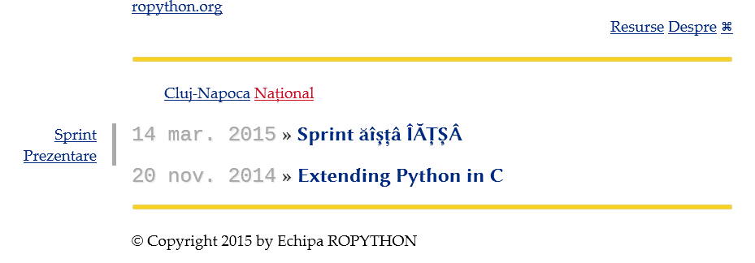

Agregator de evenimente - ropython.org
###############################################

Overview
========

Acest agregator este defapt un blog static (implementat cu Pelican).

Articolele pentru evenimente merg intr-o structură prestabilită:

* ``content/<locatie>/<an-luna-zi>-<slug-titlu>/index.rst``

Tag-urile (gen ``sprint``, ``conferinta``, ``prezentari``, ``meetup``) se pun ca și atribute în documentul RST::

    :tags: sprint

Pentru mai multe detalii se poate consulta `documentația Pelican <http://docs.getpelican.com/en/3.5.0/>`_.

Utilizare
=========

Se foloseste `Tox <https://testrun.org/tox/>`_ pentru managementul dependintelor. Trebuie doar să rulați::

    pip install tox

Când rulați ``tox`` se vor instala automat depentințele.

Comenzi:

* ``tox -e watch`` - regenerează HTML-ul din ``output/`` în continuu.
* ``tox -e web`` - rulează un server web (va servi fișierele din ``output/``)
* ``tox -e import -- --help`` - pentru import evenimente de pe meetup.com
* ``tox -e build`` - generează HTML-ul cu configurația de deployment.

Machete
=======

https://github.com/RoPython/sprints/tree/master/note-intalniri/2015-02-28-sprint

Screenshot
==========

